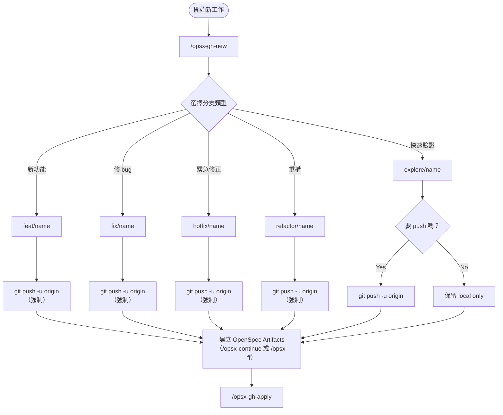
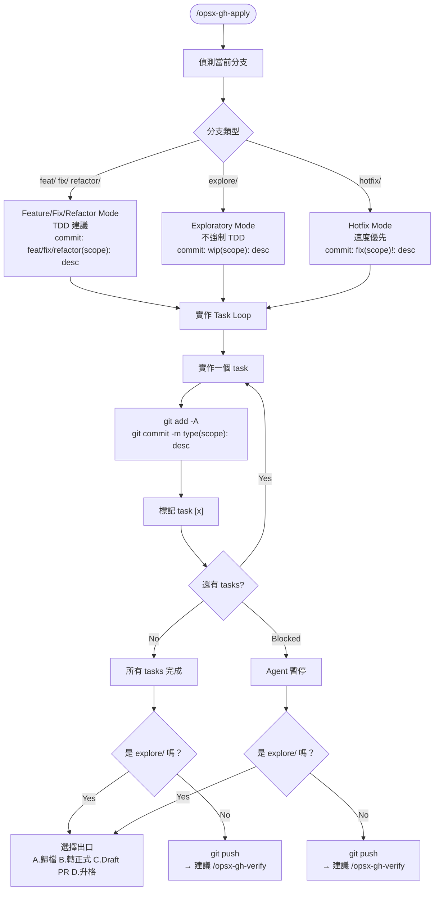
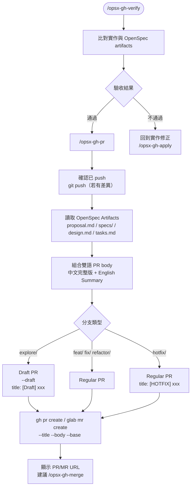
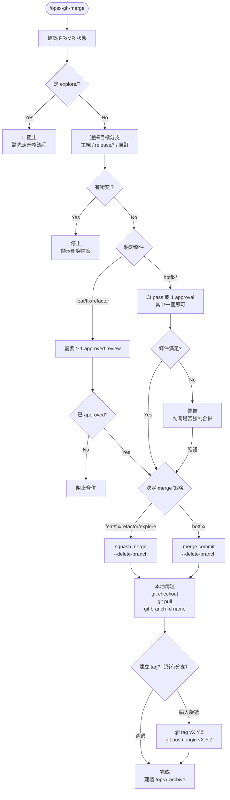

# opsx-gh* 完整流程圖

## 主流程

---

## /opsx-gh-apply 實作流程

---

## /opsx-gh-verify → /opsx-gh-pr 流程

---

## /opsx-gh-merge 合併流程

---

## 完整端到端流程（概覽）

---

## 分支類型對照表

| 分支前綴 | 用途 | TDD | Push on new | Commit type | PR/MR type | Merge strategy |
|---------|------|-----|------------|-------------|-----------|----------------|
| `feat/` | 新功能 | 建議 | 強制 | `feat(scope):` | Regular | Squash |
| `explore/` | 快速驗證 | 不強制 | 詢問 | `wip(scope):` | Draft / WIP | Squash（需升格） |
| `fix/` | 修 bug | 建議 | 強制 | `fix(scope):` | Regular | Squash |
| `hotfix/` | 緊急修正 | 非必要 | 強制 | `fix(scope)!:` | Regular `[HOTFIX]` | Merge commit |
| `refactor/` | 重構 | 建議 | 強制 | `refactor(scope):` | Regular | Squash |
