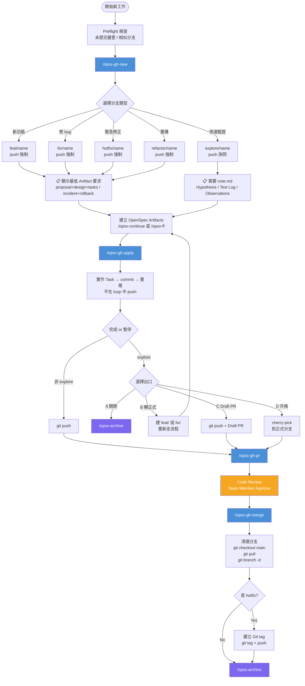
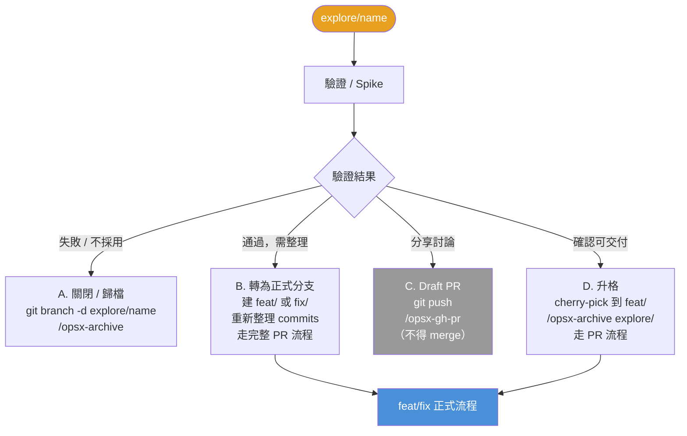
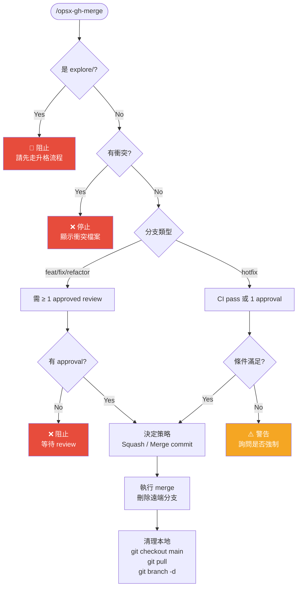

# opsx-gh* 操作指引

> OpenSpec + GitHub 整合工作流程說明文件
> 版本：v1.2 | 更新：2026-03-17

---

## 概覽

`opsx-gh*` 是一套結合 OpenSpec change management 與 GitHub 的 AI 驅動工作流程。
透過 4 個主要 skill，從建立分支到合併 PR，全程有結構地管理每個功能的開發週期。

```
/opsx-gh-new  →  建 artifacts  →  /opsx-gh-apply  →  /opsx-gh-pr  →  /opsx-gh-merge  →  /opsx-archive
```

---

## 前置需求

| 工具 | 說明 | 確認指令 |
|------|------|---------|
| `git` | 版本控制 | `git --version` |
| `gh` | GitHub CLI | `gh --version` |
| `openspec` | Change management CLI | `openspec --version` |
| GitHub 認證 | gh 已登入 | `gh auth status` |

> **未安裝 gh？**
> Windows: `winget install GitHub.cli`
> macOS: `brew install gh`
> 安裝後執行 `gh auth login`

---

## 分支類型速查表

| 分支前綴 | 使用情境 | TDD | PR 類型 | Merge 策略 |
|---------|---------|-----|---------|-----------|
| `feat/` | 新功能開發 | 建議 | Regular | Squash |
| `fix/` | 修復已知 bug | 建議 | Regular | Squash |
| `hotfix/` | Production 緊急修正 | 非必要 | Regular `[HOTFIX]` | Merge commit |
| `refactor/` | 重構，不加新功能 | 建議 | Regular | Squash |
| `explore/` | 快速驗證 / Spike | 不強制 | Draft（不得 merge） | Squash（需升格） |

---

## Skill 詳細說明

### `/opsx-gh-new` — 建立新的工作分支

**用途**：建立 OpenSpec change + Git 分支，初始化開發環境

**使用時機**：要開始一個新功能、修 bug、或快速驗證想法時

**執行流程**：
1. 說明要做什麼（change 名稱或描述）
2. Preflight 檢查（uncommitted changes、相似分支偵測）
3. 確認是全新功能還是既有功能延伸
4. 選擇分支類型（feat / fix / hotfix / refactor / explore）
5. **確認 base branch**（預設 main，可更改）
6. 建立 OpenSpec change 目錄
7. 建立 Git 分支並 push（explore 分支詢問是否 push）
8. 顯示此分支類型的 **最低 Artifact 要求**

**最低 Artifact 要求**：
| 分支類型 | 需要的 Artifacts |
|---------|----------------|
| `feat/` `refactor/` | `proposal.md` + `design.md` + `tasks.md` |
| `fix/` | `tasks.md` + `design.md`（設計筆記即可） |
| `explore/` | `note.md`（Hypothesis / Test Log / Observations / Conclusion） |
| `hotfix/` | `incident.md`（事件描述 + Root Cause）+ `rollback.md`（回滾步驟） |

**常用指令範例**：
```
/opsx-gh-new add-user-auth
/opsx-gh-new fix-login-timeout --fix
/opsx-gh-new payment-spike --explore
/opsx-gh-new db-index-tuning --hotfix
```

---

### 建立 Artifacts（`/opsx-continue` 或 `/opsx-ff`）

**這個步驟不在 opsx-gh* 範疇內，但必須完成後才能進行 apply。**

建議使用：
- `/opsx-continue` — 逐步引導建立 artifacts
- `/opsx-ff <change-name>` — 快速完成 artifacts（若已有明確需求）

---

### `/opsx-gh-apply` — 實作 Tasks + 自動 commit

**用途**：依 OpenSpec tasks 實作程式碼，每個 task 自動 commit

**使用時機**：Artifacts 準備好，可以開始寫 code 時

**執行流程**：
1. 偵測當前分支類型，決定 commit 格式
2. 取得 tasks 清單與 apply 指引
3. 逐一實作 → 標記 `[x]` → commit（**不會 mid-loop push**）
4. 全部完成或暫停時：push（非 explore 分支）/ 詢問出口選項（explore 分支）

**Commit 格式**（依分支自動判斷）：
```
feat(scope): add login endpoint
fix(scope): resolve timeout on retry
fix(scope)!: patch critical null pointer in payment
refactor(scope): extract auth middleware
wip(scope): spike on redis session store
```

**可選 flags**：
```
/opsx-gh-apply --scope payments          # 覆蓋 commit scope
/opsx-gh-apply --co-author "Alice <alice@example.com>"  # 加 Co-Authored-By
```

**explore/ 分支完成後的出口選項**：

| 選項 | 說明 | 後續動作 |
|------|------|---------|
| **A. 關閉 / 歸檔** | 驗證結果不採用 | 刪除本地分支 + `/opsx-archive` |
| **B. 轉為正式分支** | 驗證通過，整理後走正式流程 | 建 `feat/<name>` 重新提交 |
| **C. 保留為 Draft PR** | 分享討論用，不 merge | push + `/opsx-gh-pr`（產生 Draft PR） |
| **D. 升格為正式功能** | 確認可交付，直接升格 | cherry-pick 到新正式分支 + `/opsx-gh-pr` |

> ⚠️ `explore/` 分支**不得直接 merge 到 main**，必須先走上述出口之一。

---

### `/opsx-gh-pr` — 建立 GitHub Pull Request

**用途**：從 OpenSpec artifacts 自動組合雙語 PR body，建立 PR

**使用時機**：程式碼已完成並 push 到 GitHub 後

**執行流程**：
1. 確認 PR 目標分支（顯示 `<branch> → <base>`，需使用者確認）
2. **差異比較**：無差異則跳過 push；PR body 無變動則跳過更新
3. 讀取 OpenSpec artifacts，組合雙語 PR body
4. 建立或更新 PR

**PR body 結構**：
```markdown
## 概述        ← 來自 proposal.md
## 規格        ← 來自 specs/
## 設計決策    ← 來自 design.md
## 任務進度    ← 來自 tasks.md（中文區段限定）

---
*Generated from OpenSpec change: `<name>`*

---

## English Summary
### Overview        ← AI 翻譯摘要
### Key Specifications
### Design Notes
```

**Hotfix 額外欄位**（插入在 English Summary 前）：
```markdown
## 事件摘要 / Incident Summary  ← incident.md
## 回滾步驟 / Rollback Steps    ← rollback.md
```

**PR 類型**：
- `explore/` → Draft PR（`--draft`，標題加 `[Draft]`）
- `hotfix/` → Regular PR（標題加 `[HOTFIX]`）
- 其他 → Regular PR

---

### `/opsx-gh-merge` — 合併 PR + 清理分支

**用途**：驗證 PR 條件並合併，清理本地分支

**使用時機**：PR 已獲得 review approval 後

**執行流程**：
1. 取得 PR 狀態（approval、CI、衝突）
2. **explore/ 分支直接阻擋**（除非明確輸入 `--force-explore-merge` + `YES`）
3. 驗證合併條件（見下表）
4. 顯示 merge 策略後執行
5. 清理本地分支（`git checkout main && git pull && git branch -d`）
6. Hotfix 詢問是否建立 Git tag

**合併條件**：
| 分支類型 | 需求 |
|---------|------|
| `feat/` `fix/` `refactor/` | ≥ 1 approved review（必要） |
| `hotfix/` | CI pass **或** ≥ 1 approval（其中一個即可） |

**衝突**：若 `mergeable: CONFLICTING` → 立即停止，顯示衝突檔案清單

**Merge 策略**：
- `feat/` `fix/` `refactor/` `explore/`（例外）→ Squash merge
- `hotfix/` → Merge commit（保留完整緊急修正 context）

---

## 常見使用情境

### 情境 1：開發新功能

```
1. /opsx-gh-new add-oauth-login
   → 選 feat/
   → 確認 base: main
   → 顯示需要 proposal.md + design.md + tasks.md

2. /opsx-ff add-oauth-login          （快速建立 artifacts）

3. /opsx-gh-apply
   → 自動 commit 每個 task
   → 完成後 git push

4. /opsx-gh-pr
   → 確認 PR base: main
   → 建立雙語 PR

5. （team member review & approve）

6. /opsx-gh-merge
   → squash merge
   → 清理分支

7. /opsx-archive add-oauth-login
```

---

### 情境 2：緊急 Hotfix

```
1. /opsx-gh-new null-ptr-payment --hotfix
   → 需要 incident.md + rollback.md

2. 快速建立 incident.md 和 rollback.md

3. /opsx-gh-apply
   → commit: fix(payment)!: patch null pointer on refund

4. /opsx-gh-pr
   → PR 標題: [HOTFIX] patch null pointer on refund
   → PR 含 Incident Summary + Rollback Steps

5. /opsx-gh-merge
   → merge commit（保留 context）
   → 詢問是否建立 tag（如 v1.2.1）

6. /opsx-archive null-ptr-payment
```

---

### 情境 3：快速驗證 Spike（explore）

```
1. /opsx-gh-new redis-session-spike --explore
   → 詢問是否 push（可選 No，保留 local）
   → 需要 note.md

2. 建立 note.md（Hypothesis / Test Log）

3. /opsx-gh-apply
   → commit: wip(scope): ...
   → 完成後顯示出口選項

4. 選擇出口：
   A. 驗證失敗 → 歸檔，刪除分支
   B. 驗證通過，整理後正式化 → 建 feat/ 分支重新開始
   C. 分享討論 → push + Draft PR（不能 merge）
   D. 直接升格 → cherry-pick 到 feat/ 分支，走完整 PR 流程
```

---

### 情境 4：多人協作

```
1. /opsx-gh-apply --co-author "Bob <bob@example.com>"
   → 每個 commit 自動加上 Co-Authored-By: Bob <bob@example.com>

2. /opsx-gh-pr
   → PR body 包含完整 tasks 進度供 reviewer 對照
```

---

## 流程圖

### 主流程



---

### explore/ 生命週期



---

### Merge 驗證流程



---

## 缺少功能 / 潛在改善點

> 以下是目前版本可能缺少或可補強的功能，供後續規劃參考。

### 🔴 高優先（功能缺口）

| # | 項目 | 說明 |
|---|------|------|
| 1 | **`/opsx-gh-status`** | 顯示當前 PR 狀態（CI 結果、review 人數、mergeable）而不執行 merge |
| 2 | **Reviewer 指定** | `/opsx-gh-pr` 時，可透過 `--reviewer @alice` 指定 reviewer（`gh pr edit --reviewer`） |
| 3 | **Conflict 解決指引** | `/opsx-gh-merge` 偵測到衝突時，提供解決步驟指引而非只顯示衝突檔案 |
| 4 | **explore/ 選項 B 的 cherry-pick 細節** | 選項 B「轉為正式分支」目前說「整理後提交」，缺乏具體的 cherry-pick 或 rebase 指引 |

### 🟡 中優先（體驗改善）

| # | 項目 | 說明 |
|---|------|------|
| 5 | **`/opsx-gh-overview`** | 列出所有 active change 及對應的 PR 狀態（open / draft / merged / closed） |
| 6 | **Hotfix 緊急快速通道** | Hotfix 有時需要完全跳過 PR 直接 merge（緊急情況），目前只有 PR 路徑 |
| 7 | **PR label / milestone** | 建 PR 時自動加上 label（bug、enhancement、hotfix）或 milestone |
| 8 | **`/opsx-gh-revert`** | 已 merge 的 PR 需要 revert 時，自動產生 revert commit 並建新 PR |

### 🟢 低優先（進階功能）

| # | 項目 | 說明 |
|---|------|------|
| 9 | **Stale PR 清理提示** | 超過 N 天未 review 的 PR 提醒 |
| 10 | **Multi-repo support** | 目前假設 single repo，跨 repo change 尚未處理 |
| 11 | **CI 結果詳細** | `/opsx-gh-merge` 可顯示哪些 CI checks failed 而非只說「CI failing」 |

---

## 常見問題

**Q: PR 建好了，但 artifacts 更新了，body 需要重新產生嗎？**
A: 直接再執行 `/opsx-gh-pr`，skill 會比較差異，若 body 有變動才更新，不會重複觸發 CI。

**Q: `git branch -d` 刪不掉本地分支怎麼辦？**
A: `/opsx-gh-merge` 偵測到這種情況會詢問是否強制刪除（`-D`），不會自動強制執行。

**Q: explore/ 分支可以強制 merge 嗎？**
A: 可以，但需要在 `/opsx-gh-merge` 時輸入 `--force-explore-merge`，然後再次輸入 `YES` 確認。這是最後手段，建議走升格流程（選項 D）。

**Q: Hotfix 需要 PR 嗎？**
A: 目前流程需要，但 hotfix 的 merge 條件比較寬鬆：CI pass 或 1 approval 其中一個滿足即可，不需要同時。

**Q: Co-author 設定只對這次 session 有效嗎？**
A: 是的，`--co-author` 設定是 session 層級，下次執行 `/opsx-gh-apply` 需要重新指定。

---

*文件由 AI 生成，基於 opsx-gh* skill suite v1.2*
